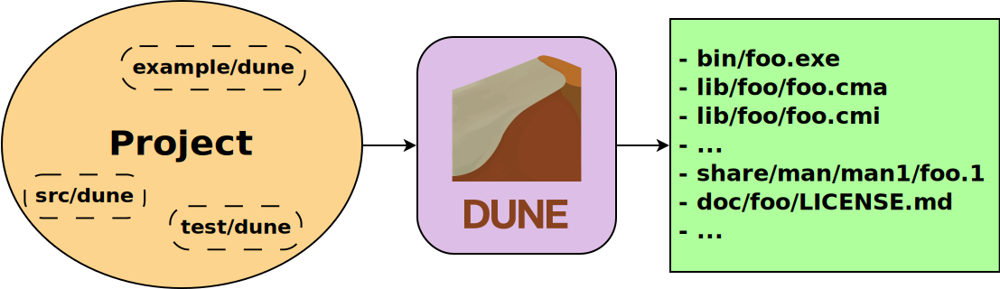
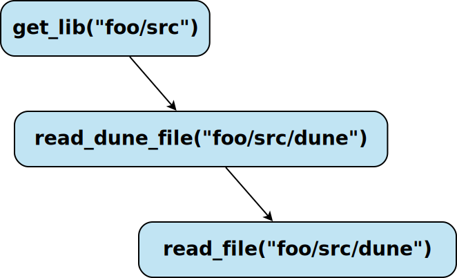

<!-- $theme: gaia -->

# Dune
### The OCaml build system

# 

#### Jeremie Dimino, Jane Street
######  @diml
######  @dimenix


---

&nbsp;
&nbsp;


---


---

# The history of Dune

---

&nbsp;

At the beginning, there was Jenga and the Jenga rules...

&nbsp;

... then a domain specific tool called jbuilder...

&nbsp;

... and finally Dune.

---

# What is Dune?

---




&nbsp;

```scheme
(library
 (public_name mylib)
 (libraries base re lwt))
 
; Custom build rule
(rule (with-stdout-to m.ml (run gen/gen.exe)))
```


---

&nbsp;


---

# Interesting Dune features

- Composability
- Multiple build contexts

---

# How does it work?

---

&nbsp;
&nbsp;


---

# Memoisation framework




---

# The end

####  [dune.build](dune.build)
####  discuss.ocaml.org
####  opensource.janestreet.com
