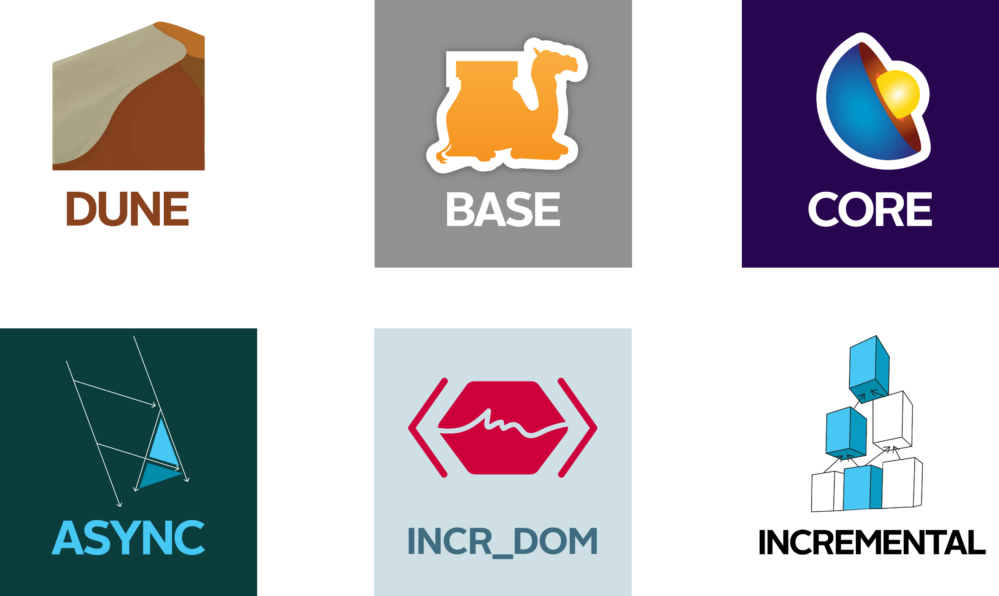
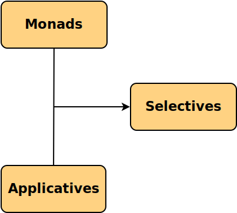

<!-- $theme: gaia -->

# Get your money's worth with Selective Functors

#### Jeremie Dimino, Jane Street
######  @diml
######  @dimenix

---


---




---



---

# github.com/janestreet

-  base
-  core
-  async
-  incr_dom
-  incrental
- ...

Over 100 packages

---


---

src/dune:
```scheme
(library
 (public_name mylib)
 (libraries re lwt))
 
(rule (with-stdout-to m.ml (run gen/gen.exe)))
```

src/gen/dune:
```scheme
(executable
 (name gen)
 (libraries ppxlib))
```

---

# Dune's internals

1. Generate rules
2. Run the build


---

# The =='a Build.t== selective

```ocaml
type rule = Action.t t
```


```ocaml
val dyn_deps : ('a   * Dep.Set.t) t -> 'a t
val     deps :  'a t * Dep.Set.t    -> 'a t
```

---

# Selective parsers

jobjo.github.io/2019/05/19/applicative-parsing.html


---

# The end

####  discuss.ocaml.org
####  opensource.janestreet.com
