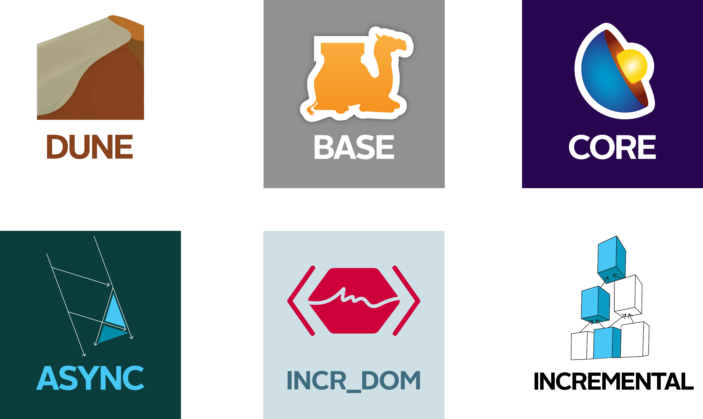
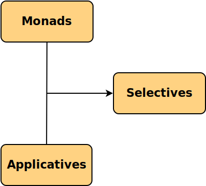
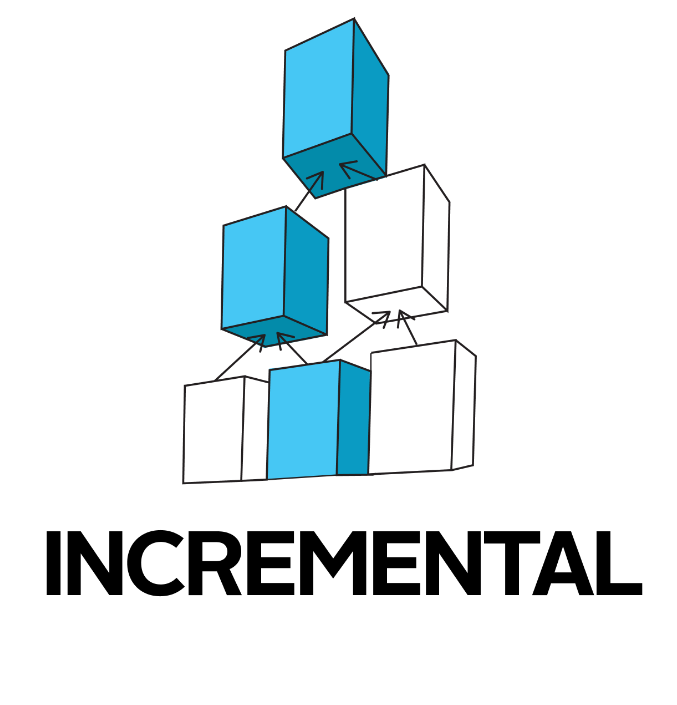
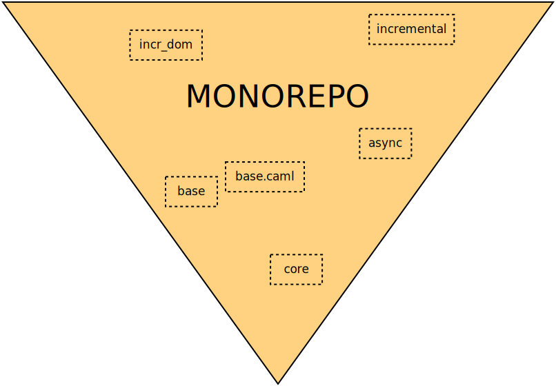
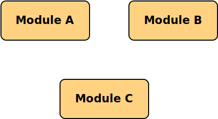
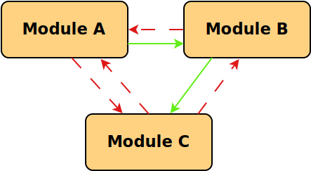
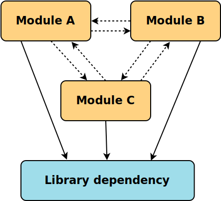

<!-- $theme: gaia -->

# Selective Functors in Build Systems

#### Jeremie Dimino, Jane Street
######  @diml
######  @dimenix

---

&nbsp;
&nbsp;


---




---

# What are selective functors?

---



---

# Selective Functors

&nbsp;
&nbsp;

```haskell
class Applicative f => Selective f where
  select :: f (Either a b) -> f (a -> b) -> f b
```

&nbsp;
Operator: `<*?`

---

# Selective combinators

```haskell
whenS :: Selective f => f Bool -> f () -> f ()
branch :: Selective f => f (Either a b)
  -> f (a -> c) -> f (b -> c) -> f c
ifS :: Selective f => f Bool -> f a -> f a -> f a
(<||>) :: Selective f => f Bool -> f Bool -> f Bool
(<&&>) :: Selective f => f Bool -> f Bool -> f Bool
anyS :: Selective f => (a -> f Bool) -> [a] -> f Bool
allS :: Selective f => (a -> f Bool) -> [a] -> f Bool
fromMaybeS :: Selective f => f a -> f (Maybe a) -> f a
whileS :: Selective f => f Bool -> f ()
```

---

# Limited form of dependance

&nbsp;
&nbsp;

```haskell
bindBool :: Selective f => f Bool -> (Bool -> f a) -> f a
bindBool x f = ifS x (f False) (f True)
```

&nbsp;
Works with any enumerable type.

---

# Is it really worth it?

---

# github.com/janestreet

-  base
-  core
-  async
-  incr_dom
-  incrental
- ...

Over 100 packages

---



---
&nbsp;
src/dune:
```scheme
(library
 (public_name mylib)
 (libraries re lwt))
 
(rule (with-stdout-to m.ml (run gen/gen.exe)))
```

src/gen/dune:
```scheme
(executable
 (name gen)
 (libraries ppxlib))
```

---

# Dune's internals

1. Generate rules
2. Run the build

&nbsp;


---

# The ==Build== selective

```haskell
-- Action DSL
data Action = Run Path [String] | Chdir Path Action | ...

-- The Build selective
data Build a = Build a [Path]

-- A Build system rule
data Rule = Rule (Build Action) [Path]

-- Read the contents of a file
read :: Path -> Build String

-- Declare a file that the action will read
dep :: Path -> Build ()
dep fn = Build () [fn]
```

---

# OCaml compilation

- modules must be compiled in order
- the `ocamldep` tool computes dependencies 




---

# Exercise

Compute the list of rules to build a library

```haskell
-- Command that compiles a module
ocamlc :: ModuleName -> Action

-- Get the dependency of a module
ocamldep :: ModuleName -> Build [Path]

-- Declare dependencies and compile a module
compileModule :: ModuleName -> [ModuleName] -> Build Action
compileModule m l = ??

```

---

# Solution

&nbsp;


```haskell
compileModule :: ModuleName -> [ModuleName] -> Build Action
compileModule m l =
  foldr waitDep (ocamlc m) (filter (<> m) l)
  where
    isDep x = (mem x) <$> (ocamldep m)
    waitDep x acc =
      (ifS (isDep x) (dep x) (return ())) *> acc
```

---

# Compiling a library


---

# Compiling a library



---

# Unconditional dependencies



---

# The end

####  discuss.ocaml.org
####  opensource.janestreet.com
